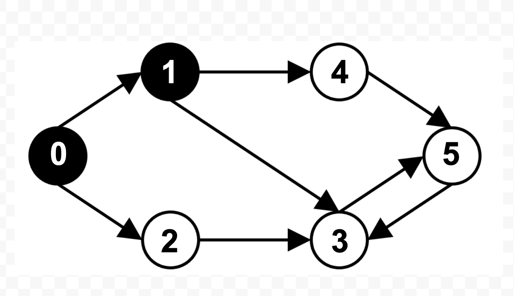

# 5. Weighted Graph

The files [graph.h](graph.h) and [graph.c](graph.c) implement a Graph data structure, along with an algorithm to find articulation points, and Dijkstra’s algorithm for finding the shortest distance between two vertices.

## Usage

```sh
make
./graph
```

### Input



The graph data to use is hard-coded in [main.c](main.c):
```c
Graph* g = construct_graph(6);  // define a graph with vertices 0 thru 5
graph_add_edge(g, 0, 1, 10.0);  // add edge from 0 -> 1, with weight 10.0
graph_add_edge(g, 0, 2, 10.0);
graph_add_edge(g, 1, 3, 10.0);
graph_add_edge(g, 1, 4, 10.0);
graph_add_edge(g, 2, 3, 10.0);
graph_add_edge(g, 3, 5, 10.0);
graph_add_edge(g, 4, 5, 10.0);
graph_add_edge(g, 5, 3, 10.0);
```

### Sample output

```txt
Calling print_graph...
[0] -> 1, 2
[1] -> 3, 4
[2] -> 3
[3] -> 5
[4] -> 5
[5] -> 3
Calling depth_first_traversal...
0 -> 1 -> 3 -> 5 -> 4 -> 2
Calling find_articulation_points...
Articulation points: 0 1 
Dists from v #0: 0 10 10 20 20 30 
Dists from v #1: inf 0 inf 10 10 20 
Dists from v #2: inf inf 0 10 inf 20 
Dists from v #3: inf inf inf 0 inf 10 
Dists from v #4: inf inf inf 20 0 10 
Dists from v #5: inf inf inf 10 inf 0 
Diameter: 30
```