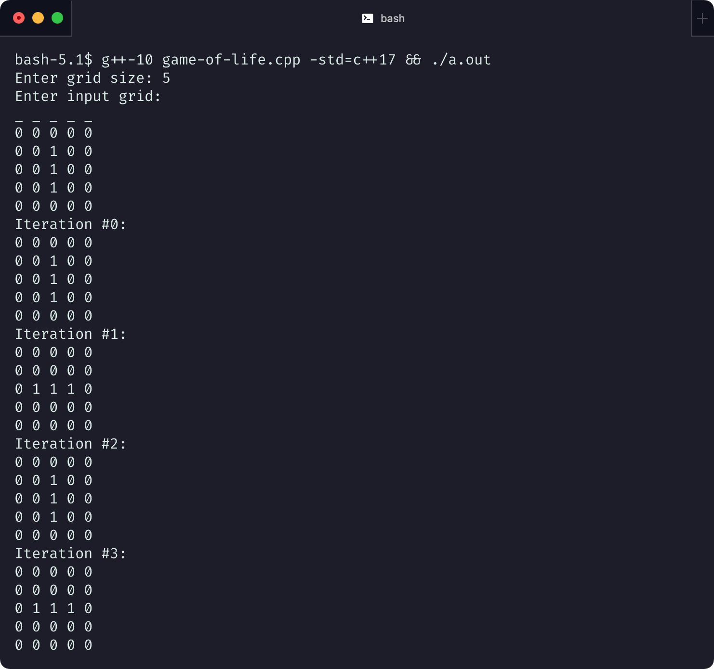

# Assignment 1: Game of Life

KSU College of Computing and Software Engineering<br>
CS 4306 - Algorithm Analysis

## Problem Statement

Create an algorithm to perform iterations of Conway's Game of Life on a $5 \times 5$ and $10 \times 10$ grid, and understand the time and space complexity of that algorithm.

## Algorithm

The Game of Life is a cellular automata. It can be defined as a 2D grid of cells which can be in an either "alive" or "dead" state. For any state of the cells, the next state is determined by the number of neighbors which each cell has.

A naive algorithm for finding the next $N$ iterations of Conway's Game of Life in a finite grid, is to simply check every single cell for life or death, and place its new value into a new matrix. Because we don't want to change the number of neighbors In a small, finite grid, this is fairly performant, but if we were trying to process an arbitrarily large grid (containing a lot of empty space), we'd want something more performant.

### Formal definition

Using the language of boolean matrices, we can define the simple algorithm like this:

1. Initialize two boolean matrices, $A$ and $B$.
2. Populate $A$ with the current state of the game.
   a. An element with value $0$ is "dead".
   b. An element with value $1$ is "alive".
3. For each element $a_{ij}$ in $A$...
   a. Let $n$ be the count of "neighbor" elements (e.g. $a_{i-1,j-1}\dots a_{i+1,j+1}$) which are equal to $1$.
   b. If $a_{ij} = 0$ and $n = 3$, then $b_{ij} = 1$ ("Birth")
   c. If $a_{ij} = 1$ and $2 \le n \le 3$ then $b_{ij} = 1$ ("Survival")
   e. Else, $b_{ij} = 0$ ("Death")
4. $B$ now contains the 1st iteration.

We could then swap $A$ and $B$, and repeat Step 3 for the desired number of iterations.

### C++ Implementation

I implemented the above algorithm in `game_of_life.cpp`, a hasty C++ program. C++ is not my most comfortable language, but unlike Java, its performance is generally easy to predict. I've done my best to explain the implementation below; the full source file is attached at the end of this document.

#### Defining a matrix

My implementation defines a custom type `grid_t` equivalent to a `std::vector<vector<bool>>` (a 2D vector of booleans), which is equivalent to a boolean matrix. Using the `std::vector` here makes them much easier to construct, destruct, and pass between functions. While this implementation could probably be sped up by judicious use of pointers and low-level memory modification, all solutions which iterate across every cell ("linear solutions") will have the exact same time complexity, regardless of actual compilation and execution speed.

```cpp
typedef bool cell_t;
typedef vector<cell_t> row_t;
typedef vector<row_t> grid_t; // 2D vector of booleans
```

##### Building a matrix

The following trivial helper functions are used to create grids. `generate_grid_from_cin` uses `std::cin` to read a list of numbers from the user, and use those values to populate the grid.

```cpp
// Constructs an empty grid of the given size.
grid_t generate_grid(grid_t::size_type rows, row_t::size_type cols) { //...

// Prompt the user to input values and construct a grid.
grid_t generate_grid_from_cin() { //...

// Constructs a square board of the given size populated with random cells.
grid_t generate_grid_from_random(grid_t::size_type size) {//...
```

##### Processing the grid

These functions access the resulting grid and determine whether a given cell should live or die.

```cpp
// Returns whether the cell at row r, col c is alive.
// All cells outside of the grid are dead.
bool is_cell_alive(const grid_t &grid, int r, int c) { //...

// For the cell at row r, col c, count how many neighboring cells are alive
unsigned int count_neighbors(const grid_t &grid, int r, int c) { //...

// Returns the next state for the cell at the given coordinates.
bool cell_will_live(const grid_t &grid, int r, int c) {
  bool alive = is_cell_alive(grid, r, c);      // access the grid cell
  int neighbors = count_neighbors(grid, r, c); // count this cell's living neighbors
  // alive cells with lt 2 or gt 3 neighbors become dead.
  if (alive && (neighbors < 2 || 3 < neighbors)) return false;
  // Dead cells with 3 neighbors become alive.
  if (!alive && neighbors == 3) return true;
  return alive;
}
```

The function `next_grid` iterates over the grid, and generates a new grid containing the next iteration.

```cpp
// Given a grid, return a new grid with the next state.
grid_t next_grid(const grid_t &grid) {
  // initialize an empty grid of the same size as the last one.
  grid_t next = grid_t(grid.size(), row_t(grid[0].size(), 0));
  // for each element, apply the cell_will_live function.
  for (int i = 0; i < grid.size(); i++) {
    for (int j = 0; j < grid[i].size(); j++) {
      next[i][j] = cell_will_live(grid, i, j);
    }
  }
  return next_grid;
}
```

##### Printing multiple iterations

Finally, a function which repeatedly calls `next_grid`, and prints the resulting iterations.

```cpp
// Given a grid, print out several iterations of it.
void simulate(grid_t &grid, unsigned int iteration_count) {
  for (int i = 0; i <= iteration_count; i++) {
    std::cout << "Iteration #" << i << ":\n";
    std::cout << grid; // operator<< is overloaded to print the grid nicely.
    grid = next_grid(grid);
  }
}

// Overload the << operator to print the given grid to stdout
std::ostream &operator<<(std::ostream &out, const grid_t &grid) { //...
```

### Screenshot of execution



## Analysis & Conclusion

### Time complexity

As I wrote my algorithm, I hypothesized that it would have **linear time complexity** with respect to the number of cells in the array. In other words, on an $m \times n$ grid, the time complexity would be $O(n \times m)$. This seems sensible: the algorithm has to execute one loop per cell.

On my 2015 MacBook Pro, I ran a few speed tests on the program, with varying sizes of arrays, and randomized inputs (50% alive, 50% dead).

The result was this graph, which seemed to confirm my hypothesis.

.

### Space complexity

The space complexity was similarly simple to reason about: C++ vectors are directly analogous to allocated memory chunks. One C++ boolean usually takes up a single byte, so a matrix of $m \times n$ booleans would occupy$m \times n$ bytes. **The space complexity is linear.**

After looking through some C++ reference documents, it turns out that `std::vector<bool>` actually attempts to save memory by storing each `bool`s as a *bit* rather than a whole byte:

> The storage is not necessarily an array of bool values, but the library implementation may optimize storage so that each value is stored in a single bit. [...] These changes provide a quirky interface to this specialization and favor memory optimization over processing (which may or may not suit your needs).

See [std::vector<bool> on cplusplus.com](http://www.cplusplus.com/reference/vector/vector-bool/).

On a 64-bit machine, that would mean that each byte of allocated vector memory actually contains 64 of the cell values. Bitwise operations are costly, so while this is good for memory usage, it might be pretty bad for performance.

Sure enough, changing the implementation to avoid this type provided a noticeable increase in speed, at the cost of approximately 64 times the memory.

## Appendix A: game_of_life.cpp

The complete source code of the program is listed below:

```cpp
// game_of_life.cpp
// AUTHOR: mae morella
#include <cmath>
#include <ctime>
#include <iostream>
#include <queue>
#include <random>
#include <stdexcept>
#include <vector>

using std::cin;
using std::cout;
using std::vector;

typedef bool cell_t;
typedef vector<cell_t> row_t;
typedef vector<row_t> grid_t;

// Constructs an empty grid of the given size.
grid_t generate_grid(grid_t::size_type rows, row_t::size_type cols) {
  // initalize all values with 0
  return grid_t(rows, row_t(cols, 0));
}

// Prompt the user to input values to construct a grid of a given size.
grid_t generate_grid_from_cin() {
  std::cout << "Enter grid size: ";
  int size;
  std::cin >> size;
  grid_t grid = generate_grid(size, size);
  std::cout << "Enter input grid:\n";
  for (int i = 0; i < size; i++) std::cout << "_ ";
  std::cout << "\n";
  for (int i = 0; i < size; i++) {
    for (int j = 0; j < grid[i].size(); j++) {
      cell_t c;
      std::cin >> c;  // read from user input
      grid[i][j] = c;
    }
  }
  return grid;
}

// Constructs a boad of the given size populated with random cells.
grid_t generate_grid_from_random(grid_t::size_type size) {
  grid_t grid = generate_grid(size, size);
  for (int i = 0; i < grid.size(); i++) {
    for (int j = 0; j < grid[i].size(); j++) {
      grid[i][j] = (bool)(random() % 2);
    }
  }
  return grid;
}

// Check whether the cell at row r, col c is alive.
// All cells outside of the grid are dead.
bool is_cell_alive(const grid_t &grid, int r, int c) {
  if (0 <= r && r < grid.size() && 0 <= c && c < grid[r].size()) {
    return grid[r][c];
  } else {
    return 0;
  }
}

// For the cell at row r, col c, count how many neighboring cells are alive
unsigned int count_neighbors(const grid_t &grid, int r, int c) {
  unsigned int neighbors = 0;
  for (int i = -1; i <= 1; i++) {
    for (int j = -1; j <= 1; j++) {
      if (i != 0 || j != 0)  // exclude the current cell
        neighbors += is_cell_alive(grid, r + i, c + j);
      if (neighbors > 3) {
        return neighbors;
      }
    }
  }
  return neighbors;
}


// Determines the next state for the cell at the given coordinates.
// This function encodes the rules for the cellular automata
bool cell_will_live(const grid_t &grid, int r, int c) {
  bool alive = is_cell_alive(grid, r, c);
  int neighbors = count_neighbors(grid, r, c);
  // alive cells with lt 2 or gt 3 neighbors become dead.
  if (alive && (neighbors < 2 || 3 < neighbors)) return false;
  // Dead cells with 3 neighbors become alive.
  if (!alive && neighbors == 3) return true;
  return alive;
}

// Given a grid, return a new grid with the next state.
grid_t next_grid(const grid_t &grid) {
  // generate an empty grid of the same size as the last one.
  grid_t next_grid = grid_t(grid.size(), row_t(grid[0].size(), 0));
  for (int i = 0; i < grid.size(); i++) {
    for (int j = 0; j < grid[i].size(); j++) {
      next_grid[i][j] = cell_will_live(grid, i, j);
    }
  }
  return next_grid;
}

// Given a grid, print out several iterations of it.
void simulate(grid_t &grid, unsigned int iteration_count) {
  for (int i = 0; i <= iteration_count; i++) {
    std::cout << "Iteration #" << i << ":\n";
    std::cout << grid;
    grid = next_grid(grid);
  }
}

// Overload the << operator to print the given grid to stdout
std::ostream &operator<<(std::ostream &out, const grid_t &grid) {
  for (auto it = grid.begin(); it != grid.end(); it++) {
    for (auto jt = it->begin(); jt != it->end(); jt++) {
      // swap these characters for prettier output
      out << (*jt ? "1" : "0") << " ";
    }
    out << '\n';
  }
  return out;
}

// Main program
int main() {
  int MAX_ITERATIONS = 50;

  // grid_t grid = generate_grid_from_random(800);
  grid_t grid = generate_grid_from_cin();
  clock_t start = clock();
  simulate(grid, MAX_ITERATIONS);
  clock_t end = clock();
  // std::cout << grid;
  double milliseconds = 1000 * (double)(end - start) / CLOCKS_PER_SEC;
  std::cout << MAX_ITERATIONS << " iterations took " << milliseconds << " ms\n";
  return EXIT_SUCCESS;
}
```
