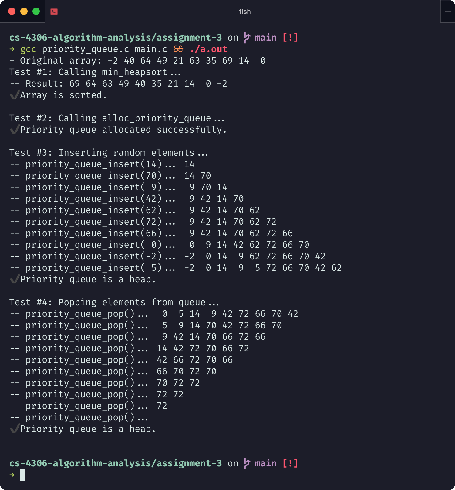

# Assignment 3: Priority Queue

KSU College of Computing and Software Engineering<br>
CS 4306 - Algorithm Analysis

Mae Morella ([mmorella@students.kennesaw](mailto:mmorella@students.kennesaw))
Feb 12, 2021

## Problem Statement

1. Implement a minimum priority queue using a heap data structure, including the descending **Heapsort(A)**, as well as the **Heapify(A, i)** and **Heap-Extract-Min(A)** algorithms shown in Chapter 6 of the Cormen, Leiserson, Rivest & Stein textbook.
2. Analyze the time complexity of the heapsort algorithm.

## Implementing Algorithms

### Defining the algorithms

Cormen et al. shows pseudocode for the following heap and priority queue algorithms:

1. $\text{Max-Heapify}(A, i)$ - which maintains the max-heap property
2. $\text{Build-Heap}(A, i)$ - which transforms an unsorted array into a max-heap
3. $\text{Heap-Sort}(A, i)$ - which sorts an array in ascending order.
4. $\text{Heap-Max}(A)$ - which returns the highest priority element
5. $\text{Heap-Extract-Max}(A)$ - which removes the highest priority element
6. $\text{Heap-Increase-Key}(A, i, k)$ - modifies a value at an index while maintaining order
7. $\text{Heap-Insert(A, k)}$ - inserts a value to the correct position in the heap

The textbook defines the argument $A$ as an array object representing a binary heap. It has the property $A.\text{heap\_size}$ (representing the number of items in the heap) and $A.\text{length}$ (representing the total capacity of the array). The elements in the range $A[1, A.\text{heap\_size}]$ are expected to be in heap order.

### Differences from the pseudocode

In theory, it should be simple to begin translating the given pseudocode into C code. There are however a few hurdles which need to be dealt with first.

#### Array indices start from 0

In C (and C-like languages), array indices start at `a[0]`, not `a[1]`. As a consequence, functions like $\text{Left}(i) = 2i$ and $\text{Right}(i) = 2i + 1$ must be implemented as `(2 * i) + 1` and `(2 * i) + 2` respectively. There are many such indices in the pseudocode which must be carefully modified from the pseudcode.

#### Non-integer data types

The textbook's implementation is only valid for a queue which strictly contains numeric values. I initially intended to create a more abstract implementation, which could handle any data type. C does not provide proper support for generic programming or template functions. However, by using type aliases, I can at least make the underlying data-type easy to change.

I defined a type alias `queue_value` to represent the value stored in the queue.

```c
typedef int queue_value;  // The type of values stored in the queue.
```

#### Defining "Array Objects"

In more abstracted language like Java or C++, it would be simple to represent the underlying "array object" $A$ as a variable-size list, such as a java.util.ArrayList, or the C++ std::vector. The number of elements in that list at any given moment would be the $\text{heap\_size}$, and the $\text{capacity}$ could be made arbitrarily large.

For the C implementations of the algorithms, I'll take in the array as a `queue_value[]` with some fixed size, and accept the `size` property as a separate parameters. By asserting a precondition, I'll simply assume that this size will never exceed the underlying array capacity.

An example function declaration for the function $\text{Max-Heapify}(A, i)$ is shown below.

```c
// Precond: The trees rooted at left(i) and right(i) are heaps, or nonexistent.
// Postcond:  The binary tree rooted at a[i] is correctly ordered.
void _prq_heapify(queue_value a[], size_t size, size_t i);
```

#### Max-heap versus min-heap

A maximum heap is ordered such that element with the largest value is at the top of the tree, and each node has a descending value. For a minimum heap, this property is reversed. To transform max-heap algorithms into min-heap algorithms, including functions like $\text{Heap-Extract-Min}(A)$ and $\text{Heap-Decrease-Key}(A)$ we could theoretically just flip all value comparisons from $>$ to $<$.

An even more useful solution is to create a more generalized heap, where the comparison function (and thus, the ordering of the elements) is arbitrarily defined, and can be easily changed. My implementation looks like this:

```c
// Compares the priority of two queue elements
// Returns 0 if a and b have equal priority
// Returns positive if a has greater priority than b
// Returns negative if a has less priority than b
static inline
int compare_queue_values(const queue_value *a, const queue_value *b) {
  // similar to `*a - *b`, but no underflow errors
  return (*a < *b) - (*a > *b);  // min-heap property.
}
```

```c
// Returns whether a has greater priority than b
static inline bool _prq_gt(queue_value a, queue_value b) {
  return compare_queue_values(&a, &b) > 0;
}
````

```c
// Returns whether a's priority is greater or equal to b's
static inline bool _prq_gte(queue_value a, queue_value b) {
  return compare_queue_values(&a, &b) >= 0;
}
```

For example, the expression "$A[l] > A[i]$" (meaning $A[l]$ should be ordered as a parent of $A[i]$), can be implemented as `_prq_gt(&a[l], &a[i])`. If I changed the comparison to `(*a > *b) - (*a < *b)`, the heap would become a max heap. With this helpful layer of abstraction, it seems appropriate to rename the algorithms to things like **Heapify**, **Heap-Peek**, **Heap-Extract**, and **Heap-Change-Key**.

#### Encapsulated priority_queue "class"

Finally, to achieve some semblance of encapsulation and abstraction, I defined a struct type `priority_queue`. It wraps around the "private" heap algorithm functions (denoted by the prefix `_prq_*`), and provides the following interface which somewhat mimics how container classes work:

```c
// from priority_queue.h
// ...

// PRIORITY QUEUE DATA STRUCTURE
// =============================

// Represents a priority queue data structure of dynamic size.
// If the queue is only modified by the given functions, its internal array
// arr will maintain the min-heap property for the elements [0, size)
typedef struct priority_queue {
  size_t capacity;    // maximum num of elements
  size_t size;        // current num of elements in queue
  queue_value arr[];  // a dynamic array with indices [0, capacity)
} priority_queue;

// Creates a new empty priority_queue of the given capacity
// Precondition: capacity > 0
// Postcondition: the return value points to a priority_queue, or is NULL
priority_queue *alloc_priority_queue(size_t capacity);

// Returns the number of elements in a priority queue
// Equivalent to accessing q.size
size_t priority_queue_size(const priority_queue *q);

// Returns the smallest element in the queue.
// Precondition: q.size != 0 (the queue is not empty)
queue_value priority_queue_peek(const priority_queue *q);

// Removes the highest priority element in the queue.
// If the queue is empty, this function fails silently.
void priority_queue_pop(priority_queue *q);

// Adds a new element to the queue.
// Postcondition: If the queue is full, this function fails silently and the
// queue remains unchanged.
void priority_queue_insert(priority_queue *q, queue_value key);
```

In the next section, I will show both the priority_queue function implementations, and the underlying heap algorithms which they wrap around.

### Writing the heap algorithm implementations

#### 0. Left, Right, and Parent

```c
static inline size_t _prq_left(size_t i) { return i * 2 + 1; }
```

```c
static inline size_t _prq_right(size_t i) { return i * 2 + 2; }
```

```c
static inline size_t _prq_parent(size_t i) { return (i + 1) / 2 - 1; }
```

#### 1. Heapify

The recursive $\text{Heapify}(A, i)$ function is shown below. Notable is the inclusion of several `assert` statements which verify that the function's precondition and postconditions are both working as expected. If a macro `NDEBUG` ("no debug") is defined at compile-time, these assert statements will be ignored, and so ultimately will not contribute to the complexity of these algorithms when used in "production" code.

```cpp
// Recursively maintains the heap property
// Precond: The trees rooted at left(i) and right(i) are heaps, or nonexistent.
// Postcond:  The binary tree rooted at a[i] is correctly ordered.
void _prq_heapify(queue_value a[], size_t size, size_t i) {
  size_t l = _prq_left(i);
  size_t r = _prq_right(i);
  assert(_prq_is_heap(a, l, size));  // verify precondition
  assert(_prq_is_heap(a, r, size));
  size_t largest = i;
  if (l < size && _prq_gt(a[l], a[largest])) {
    largest = l;
  }
  if (r < size && _prq_gt(a[r], a[largest])) {
    largest = r;
  }
  if (largest != i) {
    queue_value temp = a[i];
    a[i] = a[largest];
    a[largest] = temp;
    _prq_heapify(a, size, largest);
  }
  assert(_prq_is_heap(a, size, i));  // verify postcondition
}
```

Where $n = A.\text{heap\_size}$, the maximum size of a child tree is $2n/3$. As explained in the textbook, the running time of this algorithm is thus defined by the recurrence relation:

$$
T(n) \le T(2n/3) + \Theta(C)
$$

The running time of $\text{Heapify}(A)$ is $O(\log n)$. In other words, with respect to the height of the tree $h$, it is $O(h)$.

#### 2. Build-Heap

Implementation for $\text{Build-Heap}(A)$:

```c
// Builds a heap
// PRECOND:  a[] is an unordered array
// POSTCOND: The elements in range a[0, size) are now a heap.
void _prq_heap_build(queue_value a[], size_t size) {
  for (int i = (size - 1) / 2; 0 <= i; --i) {
    _prq_heapify(a, size, i);
  }
  assert(_prq_is_heap(a, size, 0));  // verify postcondition
}
```

This function's running time has the upper bound $O(n)$. This is explained in the textbook as the result of the following summation:

$$
\sum_{h=0}^{\lfloor \log n \rfloor } \left\lceil \frac{n}{2^{h + 1}} \right\rceil O(h)
= O\left(n \sum_{h = 0}^\infin \frac{h}{2^h} \right) = O(n)
$$

#### 3. Heap-Sort

```c
// Sorts an array using heaps
// PRECOND:  a[] is an unordered array
// POSTCOND: The elements in range a[0, size) are sorted with their keys in
//           ascending order
void heap_sort(queue_value a[], size_t size) {
  _prq_heap_build(a, size);
  for (int i = size; 2 <= i; --i) {
    queue_value temp = a[i - 1];
    a[i - 1] = a[0];
    a[0] = temp;
    size--;
    _prq_heapify(a, size, 0);
  }
  assert(_prq_is_sorted(a, size));  // verify postcondition
}
```

This function performs a loop $n-1$ times, and within that loop it calls $\text{Heapify}$, which takes $O(\log n)$.

$$
\sum_{i = 0}^{n} (\log n) = n (\log n) \implies O(n \log n)
$$

#### 4. Heap-Peek

This is the equivalent of $\text{Heap-Max}(A)$ or $\text{Heap-Min}(A)$, depending on how the input array is sorted.

```c
// Returns the element with the largest key
// PRECOND: size != 0
queue_value _prq_heap_peek(const queue_value a[], size_t size) {
  assert(size != 0);  // verify precondition
  return a[0];
}
```

```c
queue_value priority_queue_peek(const priority_queue *q) {
  return _prq_heap_peek(q->arr, q->size);
}
```

This function just makes a single array access. It is constant time, $O(1)$.

#### 5. Heap-Extract

This algorithm needs to permanently modify the size parameter, so it takes it in as a pointer. In C++, this would probably be done via pass-by-reference.

```c
// Removes the element with the largest key
// PRECOND:  size != 0
// POSTCOND: size = size - 1
queue_value _prq_heap_extract(queue_value a[], size_t *size) {
  assert(*size > 0);  // verify precondition
  queue_value min = a[0];
  --(*size);
  a[0] = a[*size - 1];
  _prq_heapify(a, *size, 0);
  return min;
}
```

The `priority_queue` wrapper function has the added behavior of failing silently if the

```c
void priority_queue_pop(priority_queue *q) {
  if (q->size > 0) {
    _prq_heap_extract(q->arr, &q->size);
  }
}
```

This function performs a constant amount of work $O(1)$ in addition to the $O(\log n)$ complexity of $\text{Heapify}$. Therefore it takes $O(\log n)$ time.

#### 6. Heap-Change-Key

```c
void _prq_heap_change_key(queue_value a[], size_t i, queue_value k) {
  a[i] = k;
  while (i > 0 && _prq_gt(a[i], a[_prq_parent(i)])) {
    queue_value temp = a[i];
    a[i] = a[_prq_parent(i)];
    a[_prq_parent(i)] = temp;
    i = _prq_parent(i);
  }
}
```

This function loops once for every time $i = \text{Parent}(i)$ does not result in $i \le 0$; thus, the number of executions is the same as the depth of the current node. In the worst case, this is the same as the *height* of the heap, which is bounded by $\Theta (\log n)$.

$$
\sum_{i=0}^{\lfloor \log n \rfloor} \left( 1 \right) \approx \log n \implies O(\log n)
$$

#### 7. Heap-Insert

```c
void _prq_heap_insert(queue_value a[], size_t *size, queue_value key) {
  assert(_prq_is_heap(a, *size, 0));
  _prq_heap_change_key(a, *size, key);
  ++(*size);
  assert(_prq_is_heap(a, *size, 0));
}
```

```c
void priority_queue_insert(priority_queue *q, queue_value v) {
  if (q->size != q->capacity) {
    _prq_heap_insert(q->arr, &q->size, v);
  }
}
```

This function merely performs a constant amount of work on top of the  $\text{Heap-Change-Key}$ implementation, so it too has a running time in $O(\log n)$.

#### The main program

Finally, tor the sake of testing these operations, I developed the program in `main.c` to demonstrate the usage of the priority_queue algorithms. A screenshot of the full execution of this code is shown in Appendix A.

```c
// excerpt from main.c
// ...
int main() {
  // ...
  priority_queue *q_ptr = alloc_priority_queue(nums_len);
  assert(q_ptr != NULL && q_ptr->size == 0);
  printf("✔️ Priority queue allocated successfully.\n\n");

  printf("Test #3: Inserting random elements...\n");
  srand(time(NULL));
  for (int i = 0; i < q_ptr->capacity; i++) {
    int value = rand() % 100 - 9;
    printf("-- priority_queue_insert(%2d)... ", value);
    // call priority_queue_insert
    priority_queue_insert(q_ptr, value);
    print_array(q_ptr->arr, q_ptr->size);
  }
  assert(_prq_is_heap(q_ptr->arr, q_ptr->size, 0));
  printf("✔️ Priority queue is a heap.\n\n");
  // ...
}
```

## Appendices

### Appendix A: Screenshots of execution



### Output

```sh
$ ./a.out

-- Original array:  8  6  7  5  3  0  9 80 60 70 50 30  0 90
Test #1: Calling min_heap_build...
-- Result:  0  3  0  5  6  7  9 80 60 70 50 30  8 90
✔️ Array is in heap order.

Test #2: Calling min_heapsort...
-- Result: 90 80 70 60 50 30  9  8  7  6  5  3  0  0
✔️ Array is sorted.

Test #3: Calling alloc_priority_queue...
✔️ Priority queue allocated successfully.

Test #4: Inserting random elements...
-- priority_queue_insert(65)... 65
-- priority_queue_insert(38)... 38 65
-- priority_queue_insert(24)... 24 65 38
-- priority_queue_insert(78)... 24 65 38 78
-- priority_queue_insert(86)... 24 65 38 78 86
-- priority_queue_insert(14)... 14 65 24 78 86 38
-- priority_queue_insert(55)... 14 65 24 78 86 38 55
-- priority_queue_insert(39)... 14 39 24 65 86 38 55 78
-- priority_queue_insert(76)... 14 39 24 65 86 38 55 78 76
-- priority_queue_insert(66)... 14 39 24 65 66 38 55 78 76 86
-- priority_queue_insert(50)... 14 39 24 65 50 38 55 78 76 86 66
-- priority_queue_insert(36)... 14 39 24 65 50 36 55 78 76 86 66 38
-- priority_queue_insert(67)... 14 39 24 65 50 36 55 78 76 86 66 38 67
-- priority_queue_insert(47)... 14 39 24 65 50 36 47 78 76 86 66 38 67 55
✔️ Priority queue is a heap.

Test #5: Popping elements from queue...
-- priority_queue_pop()... 24 39 36 65 50 38 47 78 76 86 66 67 67
-- priority_queue_pop()... 36 39 38 65 50 67 47 78 76 86 66 67
-- priority_queue_pop()... 38 39 47 65 50 67 66 78 76 86 66
-- priority_queue_pop()... 39 50 47 65 86 67 66 78 76 86
-- priority_queue_pop()... 47 50 66 65 86 67 76 78 76
-- priority_queue_pop()... 50 65 66 78 86 67 76 78
-- priority_queue_pop()... 65 76 66 78 86 67 76
-- priority_queue_pop()... 66 76 67 78 86 67
-- priority_queue_pop()... 67 76 86 78 86
-- priority_queue_pop()... 76 78 86 78
-- priority_queue_pop()... 78 86 86
-- priority_queue_pop()... 86 86
-- priority_queue_pop()... 86
-- priority_queue_pop()...
✔️ Priority queue is a heap.
```

### Appendix B: Source code

### `main.c`

```c
// FILE:   main.c
// AUTHOR: Mae Morella
// ===================

// Implements a test program for the min_heap and priority_queue data structures
// defined in minheap0.h

#include <assert.h>   // for assert
#include <stdbool.h>  // for boolean type
#include <stdio.h>    // for printf function
#include <stdlib.h>   // for size_t, rand, EXIT_SUCCESS
#include <time.h>     // for time

#include "priority_queue.h"

// Helper function to print an array
// Prints out the array elements at arr[0, size)
void print_array(queue_value arr[], size_t size) {
  for (int i = 0; i < size; i++) printf("%2d ", arr[i]);
  printf("\n");
}

int main() {
  // Initialize an unsorted array of integers:
  queue_value nums[10];
  const size_t nums_len = sizeof(nums) / sizeof(nums[0]);
  for (int i = 0; i < nums_len; i++) {
    nums[i] = rand() % 100 - 9;
  }
  printf("- Original array: ");
  print_array(nums, nums_len);

  // Test #2: The heapsorted array is in descending order:
  printf("Test #1: Calling min_heapsort...\n");
  heap_sort(nums, nums_len);
  printf("-- Result: ");
  print_array(nums, nums_len);
  assert(_prq_is_sorted(nums, nums_len));
  printf("✔️ Array is sorted.\n\n");

  // Test #3: Create a struct priority_queue.
  printf("Test #2: Calling alloc_priority_queue...\n");
  priority_queue *q_ptr = alloc_priority_queue(nums_len);
  assert(q_ptr != NULL && q_ptr->size == 0);
  printf("✔️ Priority queue allocated successfully.\n\n");

  printf("Test #3: Inserting random elements...\n");
  srand(time(NULL));
  for (int i = 0; i < q_ptr->capacity; i++) {
    assert(_prq_is_heap(q_ptr->arr, q_ptr->size, 0));
    int value = rand() % 100 - 9;
    printf("-- priority_queue_insert(%2d)... ", value);
    priority_queue_insert(q_ptr, value);
    print_array(q_ptr->arr, q_ptr->size);
    // rigorously test that arr[0, size) is a heap after every operation
  }
  assert(_prq_is_heap(q_ptr->arr, q_ptr->size, 0));
  printf("✔️ Priority queue is a heap.\n\n");

  printf("Test #4: Popping elements from queue...\n");
  while (q_ptr->size > 0) {
    assert(_prq_is_heap(q_ptr->arr, q_ptr->size, 0));
    printf("-- priority_queue_pop()... ");
    priority_queue_pop(q_ptr);
    print_array(q_ptr->arr, q_ptr->size);
    // rigorously test that arr[0, size) is a heap after every operation
  }
  assert(_prq_is_heap(q_ptr->arr, q_ptr->size, 0));
  printf("✔️ Priority queue is a heap.\n\n");

  free(q_ptr);
  return EXIT_SUCCESS;
}
```

### `priority_queue.h`

```c
// FILE:   priority_queue.h
// AUTHOR: Mae Morella
// ========================
// An ADT representing a priority queue, a variable-size data
// structure whose highest priority element can be accessed in O(1).
// The insert and pop operations execute in O(log n).

#ifndef PRIORITY_QUEUE_H
#define PRIORITY_QUEUE_H

#include <stdbool.h>  // for bool
#include <stdlib.h>   // for size_t

// TYPE DEFINITIONS
// ================

typedef int queue_value;  // The type stored in the queue.

// Compares the priority of two queue elements
// Returns 0 if a and b have equal priority
// Returns positive if a has greater priority than b
// Returns negative if a has less priority than b
static inline int compare_queue_values(const queue_value *a,
                                       const queue_value *b) {
  return (*a < *b) - (*a > *b);  // min-heap property.
}

// PRIORITY QUEUE DATA STRUCTURE
// =============================

// Represents a priority queue data structure of dynamic size.
// If the queue is only modified by the given functions, its internal array
// arr will maintain the min-heap property for the elements [0, size)
typedef struct priority_queue {
  size_t capacity;    // maximum num of elements
  size_t size;        // current num of elements in queue
  queue_value arr[];  // a dynamic array with indices [0, capacity)
} priority_queue;

// Creates a new priority_queue of the given capacity
// Precondition: capacity > 0
// Postcondition: the return value points to a priority_queue, or is NULL
priority_queue *alloc_priority_queue(size_t capacity);

// Returns the number of elements in a priority queue
// Equivalent to accessing q.size
size_t priority_queue_size(const priority_queue *q);

// Returns the smallest element in the queue.
// Precondition: q.size != 0 (the queue is not empty)
queue_value priority_queue_peek(const priority_queue *q);

// Removes the highest priority element in the queue.
// If the queue is empty, this function fails silently.
void priority_queue_pop(priority_queue *q);

// Adds a new element to the queue.
// Postcondition: If the queue is full, this function fails silently and the
// queue remains unchanged.
void priority_queue_insert(priority_queue *q, queue_value key);

// HEAP SORT FUNCTION
// ==================

// Sorts an array in place, using heaps
// Precondition:  a[] is an unordered array
// Postcondition: The elements in range a[0, size) are sorted with their keys in
//           ascending order
void heap_sort(queue_value a[], size_t size);

// TESTING METHODS
// ===============

bool _prq_is_heap(const queue_value a[], size_t size, size_t i);

bool _prq_is_sorted(const queue_value a[], size_t size);

#endif /* PRIORITY_QUEUE_H */
```

### `priority_queue.c`

```c
// FILE:   priority_queue.c
// AUTHOR: Mae Morella
// ========================

#include "priority_queue.h"

// #define NDEBUG        // uncomment to disable assert()
#include <assert.h>   // for assert
#include <stdbool.h>  // for bool
#include <stddef.h>   // for size_t

// HELPER FUNCTIONS
// ================

// For the node at a[i], returns the index of the right child.
static inline size_t _prq_left(size_t i) { return i * 2 + 1; }

// For the node at a[i], returns the index of the right child
static inline size_t _prq_right(size_t i) { return i * 2 + 2; }

// For the node at a[i], returns the index of the parent node
static inline size_t _prq_parent(size_t i) { return (i + 1) / 2 - 1; }

// Returns whether a has greater priority than b
static inline bool _prq_gt(queue_value a, queue_value b) {
  return compare_queue_values(&a, &b) > 0;
}

// Returns whether a's priority is greater or equal to b's
static inline bool _prq_gte(queue_value a, queue_value b) {
  return compare_queue_values(&a, &b) >= 0;
}

// HEAP ALGORITHM IMPLEMENTATIONS
// ==============================

// Recursively maintains the heap property
// Precond: The trees rooted at left(i) and right(i) are heaps, or nonexistent.
// Postcond:  The binary tree rooted at a[i] is correctly ordered.
void _prq_heapify(queue_value a[], size_t size, size_t i) {
  size_t l = _prq_left(i);
  size_t r = _prq_right(i);
  assert(_prq_is_heap(a, l, size));  // verify precondition
  assert(_prq_is_heap(a, r, size));
  size_t largest = i;
  if (l < size && _prq_gt(a[l], a[largest])) {
    largest = l;
  }
  if (r < size && _prq_gt(a[r], a[largest])) {
    largest = r;
  }
  if (largest != i) {
    queue_value temp = a[i];
    a[i] = a[largest];
    a[largest] = temp;
    _prq_heapify(a, size, largest);
  }
  assert(_prq_is_heap(a, size, i));  // verify postcondition
}

// Builds a heap
// PRECOND:  a[] is an unordered array
// POSTCOND: The elements in range a[0, size) are now a heap.
void _prq_heap_build(queue_value a[], size_t size) {
  for (int i = (size - 1) / 2; 0 <= i; --i) {
    _prq_heapify(a, size, i);
  }
  assert(_prq_is_heap(a, size, 0));  // verify postcondition
}

// Sorts an array using heaps
// PRECOND:  a[] is an unordered array
// POSTCOND: The elements in range a[0, size) are sorted with their keys in
//           ascending order
void heap_sort(queue_value a[], size_t size) {
  _prq_heap_build(a, size);
  for (int i = size; 2 <= i; --i) {
    queue_value temp = a[i - 1];
    a[i - 1] = a[0];
    a[0] = temp;
    size--;
    _prq_heapify(a, size, 0);
  }
  assert(_prq_is_sorted(a, size));  // verify postcondition
}

// Returns the element with the largest key
// PRECOND: size != 0
queue_value _prq_heap_peek(const queue_value a[], size_t size) {
  assert(size != 0);  // verify precondition
  return a[0];
}

// Removes the element with the largest key
// PRECOND:  size != 0
// POSTCOND: size = size - 1
queue_value _prq_heap_extract(queue_value a[], size_t *size) {
  assert(*size > 0);  // verify precondition
  queue_value min = a[0];
  --(*size);
  a[0] = a[*size - 1];
  _prq_heapify(a, *size, 0);
  return min;
}

// Modifies the value at a[i] while maintaining heap property
// PRECOND: The binary tree rooted at a[i] is a heap, or nonexistent
// PRECOND: The key of input `k` is larger than the key of a[i]
// POSTCOND: The
void _prq_heap_change_key(queue_value a[], size_t i, queue_value k) {
  a[i] = k;
  while (i > 0 && _prq_gt(a[i], a[_prq_parent(i)])) {
    queue_value temp = a[i];
    a[i] = a[_prq_parent(i)];
    a[_prq_parent(i)] = temp;
    i = _prq_parent(i);
  }
}

void _prq_heap_insert(queue_value a[], size_t *size, queue_value key) {
  assert(_prq_is_heap(a, *size, 0));
  _prq_heap_change_key(a, *size, key);
  ++(*size);
  assert(_prq_is_heap(a, *size, 0));
}

// TESTING METHODS
// ===============

bool _prq_is_heap(const queue_value a[], size_t size, size_t i) {
  size_t l = _prq_left(i);
  size_t r = _prq_right(i);
  if (r >= size) {
    return true;
  }
  if (_prq_gte(a[i], a[l]) && _prq_gte(a[i], a[r])) {
    return _prq_is_heap(a, size, l) && _prq_is_heap(a, size, r);
  }
  return false;
}

bool _prq_is_sorted(const queue_value a[], size_t size) {
  for (int i = 1; i < size; i++) {
    if (!_prq_gte(a[i], a[i - 1])) {
      return false;
    }
  }
  return true;
}

// PRIORITY QUEUE PUBLIC FUNCTIONS
// ===============================

priority_queue *alloc_priority_queue(size_t capacity) {
  priority_queue *p =
      malloc(sizeof(priority_queue) + sizeof(queue_value[capacity]));
  if (p) {
    p->size = 0;
    p->capacity = capacity;
  }
  return p;
}

size_t priority_queue_size(const priority_queue *q) { return q->size; }

queue_value priority_queue_peek(const priority_queue *q) {
  return _prq_heap_peek(q->arr, q->size);
}

void priority_queue_pop(priority_queue *q) {
  if (q->size > 0) {
    _prq_heap_extract(q->arr, &q->size);
  }
}

void priority_queue_insert(priority_queue *q, queue_value v) {
  if (q->size != q->capacity) {
    _prq_heap_insert(q->arr, &q->size, v);
  }
}
```
